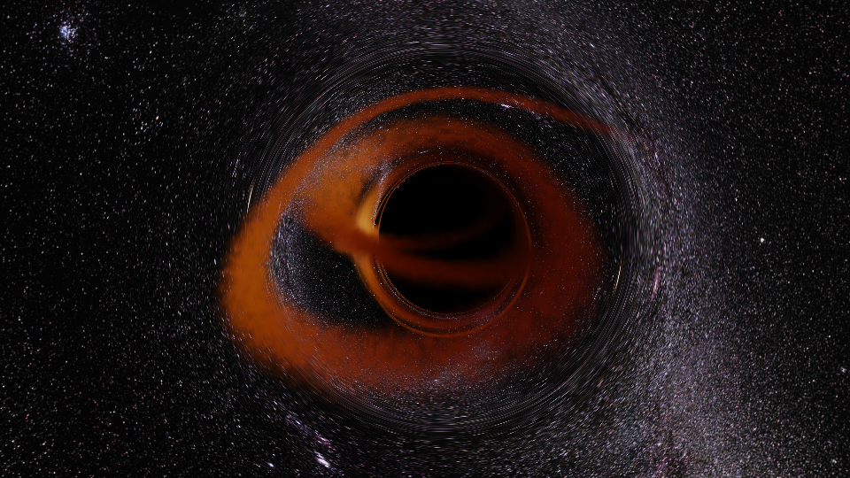

# Kerr Black Hole Sandbox (Schwarzschild + Kerr)



*A star's tidal debris circularizing around a Kerr black hole — gravitational
lensing, the photon ring, and the secondary image of the stream are all visible.
Rendered in real time on GPU.*

**GPU real-time black hole sandbox**: relativistic ray tracing with gravitational
lensing, launchable particle "stars" that get tidally disrupted and evolve into
accretion disks, reflective spheres on geodesic orbits, a curved spatial grid —
and a camera that can fly **through the event horizon**. Geometric units
$G=c=M=1$, spin $a\in[0,1)$; $a=0$ recovers Schwarzschild.

## Highlights

- **Kerr–Schild metric** (horizon-regular Cartesian form): backward null
  geodesics integrated via the super-Hamiltonian with analytic gradients and
  adaptive RK4. With the camera inside the horizon, rays keep propagating —
  you see the actual optical scene inside (the external universe compressed
  into a bright patch).
- **Tidal disruption, emergent accretion**: up to ~8M test particles follow
  full 3D timelike geodesics. Tidal stretching appears automatically; a
  phenomenological "circularization dissipation" relaxes debris streams into
  a disk. Per-frame deposition onto a 320³ density+velocity grid gives
  lensing, redshift $g=(p\cdot u_{\rm obs})/(p\cdot u_{\rm em})$, and beaming
  $g^{4\beta}$ from the *actual* deposited velocity field.
- **Interactive**: aim with a geodesic prediction line and launch stars in
  real time; place orbits solved exactly for $(E, L)$ from a chosen pericenter;
  toggle sky map / celestial grid / spatial lattice; offline-quality frame
  recording with an ffmpeg-ready output.
- **Companion analysis script** (`geodesic_orbits.py`, f64 scipy): photon
  sphere and Kerr photon shell, frame dragging, perihelion precession,
  horizons and ergosphere.

## Quickstart

```powershell
py -3.11 -m venv .venv
.venv\Scripts\pip install taichi numpy scipy matplotlib pillow
.venv\Scripts\python.exe kerr_raytracer.py     # interactive (a few seconds of JIT on first launch)
```

Requires an NVIDIA GPU (Taichi CUDA backend). Mouse to steer, WASD+Q/E to fly,
right-click to aim and release to launch a star, P for screenshots. See the
Chinese section below for the full control reference and implementation notes.

*Known approximations: f32 ray tracing (use the f64 companion for quantitative
work); inside-horizon camera is a coordinate-frame image, not a physical
observer; mirror-sphere reflection omits the sphere's own Doppler shift;
circularization dissipation is phenomenological, not hydrodynamics.*

---

# 中文完整说明

GPU 实时黑洞沙盒：引力透镜 + 可发射的粒子恒星（潮汐瓦解）+ 反光铁球 + 立体网格，
相机可飞越视界。几何单位 $G=c=M=1$，自旋 $a\in[0,1)$；$a=0$ 即 Schwarzschild。

> v2 精简版：吸积盘与喷流模块已移除 — 想要吸积盘，就发射几颗恒星、
> 开"圈化耗散"，看碎片流自己演化成盘。

## 文件

| 文件 | 用途 |
|---|---|
| `kerr_raytracer.py` | 主程序：Taichi (CUDA) 实时光线追踪 + tkinter 控制面板 |
| `geodesic_orbits.py` | scipy f64 测地线分析图：光子球、Kerr 光子壳、参考系拖曳、近日点进动、视界/能层 |
| `orbit_viewer.py` | 预渲染轨道帧查看器（`--prerender` 生成） |
| `assets/` | 赤道柱面投影天空图（ESO 银河全景，CC BY 4.0） |
| `run_raytracer.bat` 等 | 双击启动 |

## 玩法

```powershell
.venv\Scripts\python.exe kerr_raytracer.py            # 交互（启动时预编译数秒）
.venv\Scripts\python.exe kerr_raytracer.py --still --res 3840 2160 --ssaa 2 --spin 0.95
.venv\Scripts\python.exe kerr_raytracer.py --anim 240 --orbit 90 --launch   # 动画帧
```

**渲染窗口**：左键拖动转向，WASD 移动，Q/E 升降，Shift 加速，**右键按住瞄准
（青→紫渐变测地线预测线）、松开发射**，P 截图。**视界不是墙 — 可以直接飞进去**
（视界内的"静止相机"是坐标系图像，蓝移已截断；真实的自由下落观者视角在路线图上）。

**控制面板**（深色 HUD，双列）：
- 时空：自旋 a、时间流速、红移开关、束流强度 β（1=物理 g⁴）
- 投放：恒星 / 反光铁球，发射速度 β、半径、粒子数（万）、圈化耗散、亮度；
  ★ 放置轨道按近心点 r_p 精确求解 (E, L)
- 显示：银河 / 天球网格 / 立体网格，分辨率比例、步数、曝光、辉光、星芒、天空贴图
- 录制：从当前视角以离线画质逐帧渲染演化动画（ESC 中断，结束给 ffmpeg 命令）

## 物理实现

- **度规**：Kerr–Schild 笛卡尔形式（视界正则，$a\to0$ 光滑）；
  反向零测地线用超哈密顿量 + 解析梯度 + RK4 自适应步长。
  相机在视界外时光线在 $1.01\,r_+$ 处判定捕获；相机在视界内时光线继续推进、
  在奇点附近截止 — 所以能看到视界内的真实光学景象（外部宇宙压缩成亮斑）。
- **恒星**：N 个测试粒子（池默认 800 万，`--np-star-max` 可调）走**完整 3D
  类时测地线**（KS 笛卡尔，中点法，坐标时间步进）。潮汐拉伸自动出现；
  "圈化耗散"把粒子向局部平均流速弛豫（流-流碰撞的替身），碎片流会圈化成盘。
  每帧沉积到 320³ 密度+速度网格，光线步进采样 → 透镜、红移
  $g=(p\cdot u_{\rm obs})/(p\cdot u_{\rm em})$（用沉积的真实速度场）、
  束流 $g^{4\beta}$ 全部自动正确。**穿过视界即删、逃逸（E≥1 且出界）即删**，
  池死亡占比 >20% 自动压缩。
- **反光铁球**：解析球面在测地线轨道上运动（f64 numpy 积分），光线与球面求交后
  镜面反射继续积分（≤4 次反弹；静止镜近似 — 球的轨道运动不附加多普勒）。
- **瞄准预测线**：与发射完全相同初始条件的单粒子测地线（GPU 上积分），
  HUD 平面投影显示；控制台打印 E、L_z 和命运预判（E≥1 非束缚）。
- **立体网格**（显示模式 3）：空间每 5M 一条锐利发光格线（超高斯剖面 +
  每步 3 子采样），被透镜光线直接渲染 — 空间扭曲和多重成像一目了然。

## 渲染管线 / 性能

抖动 HDR → 静止时时域累积（~1 秒收敛到离线画质）→ Bloom + 星芒 →
ACES + gamma → 上采样。**双内核**：唯一的编译期开关把"恒星/铁球/晶格"
整体编译掉（精简版）或保留为运行时分支（全功能版）；两个变体启动时预热，
Taichi 磁盘缓存使第二次启动起接近秒开 — **切换任何功能都不会触发 JIT 停顿**。

## 已知近似

- f32 光线追踪（定量工作用 `geodesic_orbits.py` 的 f64）。
- 视界内相机 = 坐标系静止图像（非物理观者；自由下落 tetrad 视角已从 v2 移除）。
- 铁球反射不含球体运动的多普勒；恒星发射为固定 6000K 黑体 × 红移。
- 圈化耗散是唯象项，不是流体力学。

## 环境

`.venv`：Python 3.11 + taichi 1.7.4 (CUDA) + numpy/scipy/matplotlib/pillow。
重建：`py -3.11 -m venv .venv && .venv\Scripts\pip install taichi numpy scipy matplotlib pillow`